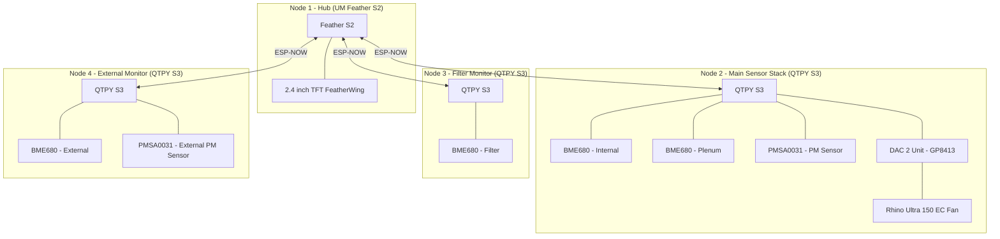

# Electronics Design & Control Logic

The CLV-3D system follows a distributed design using ESP-NOW for wireless communication between a main display hub, a centralized sensor stack, and dedicated environmental monitors.

## System Architecture

## Node Pinouts

### Node 1: Main Hub (Feather S2)
| Pin | Component | Interface | Note |
| :--- | :--- | :--- | :--- |
| 1 | TFT_CS (LCD) | SPI | Chip Select for Display |
| 3 | TFT_DC (LCD) | SPI | Data/Command for Display |
| 33 | SD_CS (SD Card) | SPI | Chip Select for SD |
| 38 | STMPE_CS (Touch) | SPI | Chip Select for Resistive Touch |
| SCK/MO/MI | TFT/Touch/SD | SPI | Shared SPI |
| D5 | TFT Backlight | PWM | |

### Node 2: Main Sensor Stack (QTPY S3)
| Pin | Component | Interface | Note |
| :--- | :--- | :--- | :--- |
| SDA/SCL | BME680 (Internal) | I2C | STEMMA QT |
| SDA/SCL | BME680 (Plenum) | I2C | STEMMA QT |
| SDA/SCL | PMSA0031 (PM) | I2C | STEMMA QT |
| SDA/SCL | DAC 2 Unit (GP8413) | I2C (0x59) | V0 (Channel 0) for 0-10V Fan Control |

### Node 3: Filter Monitor (QTPY S3)

| Pin | Component | Interface | Note |
| :--- | :--- | :--- | :--- |
| SDA/SCL | BME680 (Filter) | I2C | STEMMA QT |

### Node 4: External Monitor (QTPY S3)

| Pin | Component | Interface | Note |
| :--- | :--- | :--- | :--- |
| SDA/SCL | BME680 (External) | I2C | STEMMA QT |
| SDA/SCL | PMSA0031 (PM External) | I2C | STEMMA QT |

### Hardware Configuration Notes

- **Communication**: ESP-NOW eliminates the need for data cables between nodes. Each node acts as a wireless station.
- **Fan Control**: The GP8413 provides a 0-10V analog signal from **Channel 0 (V0)** to the Rhino Ultra 150 EC fan.
- **Initialization**: Firmware initializes the DAC to a 10V range by writing `0x11` to register `0x01` on startup.

---

## Control Logic

The system operates autonomously, adjusting fan speed based on air quality and monitoring filter health via differential pressure.

### 1. VOC-Adaptive Fan Control (Hybrid Gradient)

- **Input**: BME680 (Internal) VOC IAQ Index (0-500 scale).
- **Output**: 0-10V DAC Signal to Rhino Ultra 150 EC.
- **Baseline**: 20% speed (~120 m³/h) for constant circulation when IAQ < 50.
- **Gradient**: Proportional ramp from 20% to 80% as IAQ index rises from 50 to 200.
- **Peak**: 100% speed if IAQ index exceeds 300 or Particulate Matter (PM2.5) exceeds 50 µg/m³.
- **Smoothing**: Exponential Moving Average (EMA) with a 0.2 smoothing factor to prevent rapid speed changes.

### 2. Adaptive "Smart Idle" Mode

- **Condition**: If `Internal IAQ < 30` for > 30 minutes, the fan drops to **0% speed**.
- **Adaptive Sniffing**:
  - **Standard**: 2 mins at 20% every 6 hours (if idle < 24h).
  - **Deep Sleep**: 2 mins at 20% every 24 hours (if idle > 24h).
- **Instant Wake**: Fan resumes normal operation if `IAQ > 55` or `PM2.5 > 15`.

### 3. G4 Filter Monitoring (Differential Pressure)

- **Method**: Comparison between Node 2 (Plenum) and Node 3 (Filter) BME680 pressure readings.
- **Threshold**: Final Pressure Drop = 250 Pa (normalized for current fan speed).
- **Alert**: "Replace G4 Filter" warning displayed on Node 1 when the normalized delta exceeds 250 Pa.

### 4. Carbon Filter Efficiency Monitoring

- **Method**: Comparison of VOC levels before and after the carbon bed (Internal vs. Plenum).
- **Calculation**: `Efficiency = (VOC_in - VOC_out) / VOC_in`.
- **Threshold**: Warning triggered if removal efficiency drops below 50% during a VOC event where Internal IAQ > 100.0 (Threshold increased to prevent ghost alerts during baseline healing).

### 5. Unified Self-Healing VOC System

To prevent the "Normalization Trap"—where sensors in clean, filtered air drift apart and memorize "extra-clean" as the new zero—the system uses an aggressive, multi-node synchronization strategy.

- **The Anchor (Node 4)**: As the external reference sitting in open workshop air, Node 4 is the ultimate authority on "True Zero." It nudges its own baseline by **10%** every 5 minutes of stability to ensure it finds 0 IAQ gradually and accurately.
- **Unified Shadow Nudging (Node 2)**:
  - **Sync Rate**: Every 5 minutes, if the Internal IAQ is stable (±3 points) but remains higher than the Room (Node 4), the system performs a **10% gentle nudge**.
  - **Shadowing**: To maintain accurate filter efficiency math, any nudge applied to the Internal baseline is automatically applied to the Plenum baseline in lock-step. This ensures they "heal" together and don't trigger false carbon alerts.
- **Safety Safeguards**:
  - **Stability Window**: A strict **±3-5 IAQ** jitter tolerance prevents standard sensor noise or fan speed changes from triggering a mathematical "healing" event prematurely.
  - **Print Guard (150 IAQ Ceiling)**: Downward nudging is automatically locked out if IAQ exceeds 150.0. This ensures the system never "zeros out" actual resin fumes during a print.
  - **Room Reference Gate**: Node 2 will only nudge downward if it has proof (from Node 4) that the room air is cleaner than the cabinet.
- **Persistence (5-Minute Checkpoints)**: The system checkpoints its calibration progress to the ESP32 Non-Volatile Storage (NVS) every **5 minutes**. This ensures that even during a "Rapid Climb" (first power-up), the board never loses more than 5 minutes of progress after a power cycle.

---

## Hub User Interface

The Hub (Node 1) provides the primary interface for monitoring system health and air quality.

- **Display**: 320x240 Landscape mode with dual-page touch navigation (Dashboard vs. System Status).
- **Diagnostics**: Real-time Node RSSI (dBm) and heartbeat indicators for all wireless sensors.
- **Alerting**: High-visibility headers for critical maintenance (`REPLACE G4` in Red, `REPLACE CARBON` in Orange).
- **Power Management**: Backlight automatically dims after 5 minutes of inactivity and turns off after 15 minutes. Wake-on-touch is supported.
