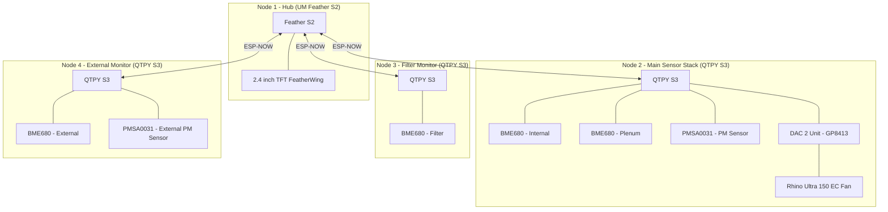

# Electronics Design & Control Logic

The CLV-3D system follows a distributed design using ESP-NOW for wireless communication between a main display hub, a centralized sensor stack, and dedicated environmental monitors.

## System Architecture

## Node Pinouts

### Node 1: Main Hub (Feather S2)
| Pin | Component | Interface | Note |
| :--- | :--- | :--- | :--- |
| 1 | TFT_CS (LCD) | SPI | Chip Select for Display |
| 3 | TFT_DC (LCD) | SPI | Data/Command for Display |
| 33 | SD_CS (SD Card) | SPI | Chip Select for SD |
| 38 | STMPE_CS (Touch) | SPI | Chip Select for Resistive Touch |
| SCK/MO/MI | TFT/Touch/SD | SPI | Shared SPI |
| D5 | TFT Backlight | PWM | |

### Node 2: Main Sensor Stack (QTPY S3)
| Pin | Component | Interface | Note |
| :--- | :--- | :--- | :--- |
| SDA/SCL | BME680 (Internal) | I2C | STEMMA QT |
| SDA/SCL | BME680 (Plenum) | I2C | STEMMA QT |
| SDA/SCL | PMSA0031 (PM) | I2C | STEMMA QT |
| SDA/SCL | DAC 2 Unit (GP8413) | I2C (0x59) | V0 (Channel 0) for 0-10V Fan Control |

---

## Control Logic

### 1. VOC-Adaptive Fan Control (Hybrid Gradient)
- **Baseline**: 20% speed (~120 m³/h) for constant circulation when IAQ < 50.
- **Gradient**: Proportional ramp from 20% to 80% as IAQ index rises from 50 to 200.
- **Peak**: 100% speed if IAQ index exceeds 300 or Particulate Matter (PM2.5) exceeds 50 µg/m³.
- **Smoothing**: Exponential Moving Average (EMA) with a 0.2 smoothing factor to prevent rapid speed changes.

### 2. Adaptive "Smart Idle" Mode
- **Condition**: If `Internal IAQ < 30` for > 30 minutes, the fan drops to **0% speed**.
- **Adaptive Sniffing**: 2 mins at 20% every 6 hours (if idle < 24h) or every 24 hours (if idle > 24h).
- **Instant Wake**: Fan resumes normal operation if `IAQ > 55` or `PM2.5 > 15`.

### 3. Unified Self-Healing VOC System
To prevent the "Normalization Trap"—where sensors in clean, filtered air drift apart—the system uses an aggressive synchronization strategy.
- **The Anchor (Node 4)**: As the external reference, Node 4 nudges its own baseline by **10%** every 5 minutes of stability to find "True Zero."
- **Unified Shadow Nudging (Node 2)**: Every 5 minutes, if the Internal IAQ is stable but remains higher than the Room (Node 4), both the Internal and Plenum baselines are nudged downward in lock-step.
- **Print Guard**: Downward nudging is locked out if IAQ exceeds 150.0 to ensure the system never "zeros out" actual resin fumes.

### 4. Filter Efficiency Monitoring
- **G4 Filter**: Comparison between Node 2 (Plenum) and Node 3 (Filter) pressure readings. Alert triggers when normalized delta exceeds 250 Pa.
- **Carbon Filter**: Comparison of VOC levels before and after the carbon bed. Warning triggered if removal efficiency drops below 50% during a VOC event.
